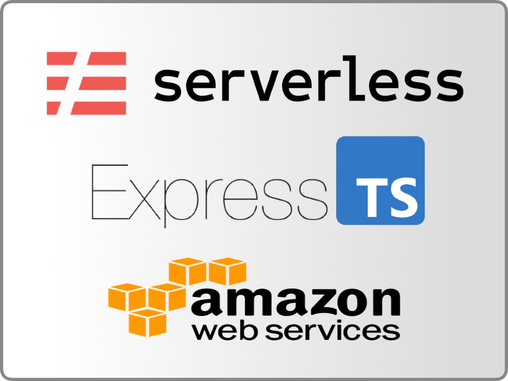
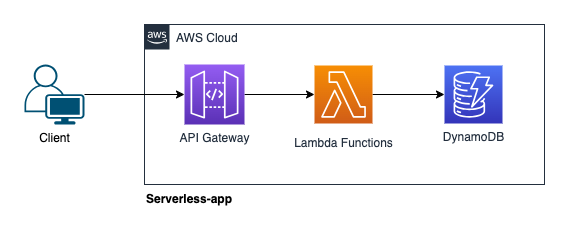

# Serverless Express.ts Template

<br/>
<p align="center">
  <a href="https://github.com/beerjoa/serverless-express-ts-template">
    
  </a>

  <h3 align="center">Serverless Express.ts Template</h3>

  <p align="center">
    A template for building serverless applications using Serverless, TypeScript and Express.js.
    <br/>
    <br/>
  </p>
</p>


## Table Of Contents

- [About the Project](#about-the-project)
- [Features](#features)
  - [Developer experiences](#developer-experiences)
  - [Back-end app features](#back-end-app-features)
- [Getting Started](#getting-started)
  - [Prerequisites](#prerequisites)
  - [Installation](#installation)
- [Usage](#usage)
- [License](#license)
- [Authors](#authors)
- [Acknowledgements](#acknowledgements)

## About The Project

<p align="center">
  <a href="https://github.com/beerjoa/serverless-express-ts-template">
    
  </a>
</p>

It can develop and deploy classed-based Express.js applications using the Serverless framework. It also includes a few other features that I find useful when building serverless applications.

- **It still needs DynamoDB implementation work.**

## Features

### Developer experiences

- [Serverless](https://www.serverless.com/framework/docs/)
- [Express](https://expressjs.com/en/4x/api.html)
- [TypeScript](https://www.typescriptlang.org/docs)
- [TypeStack](https://github.com/typestack)
- [Jest](https://jestjs.io/docs/getting-started)
- [Husky](https://typicode.github.io/husky/#/)
- [Commitlint](https://commitlint.js.org/#/)
- [ESLint](https://eslint.org/docs/latest)
- [Prettier](https://prettier.io/docs/en)

### Back-end app features

- Layered architecture. (Controller, Service(Repository), Model)
- Data Transport Object (DTO) for data validation
- Dependency injection for better code organization
- Swagger for API documentation

## Getting Started

Run the following commands to set environment variables and install dependencies:

### Prerequisites

1. Setup [**aws-cli** and **aws credentials**](https://docs.aws.amazon.com/cli/latest/userguide/getting-started-quickstart.html).
2. Install [**gh cli**](https://github.com/cli/cli#installation) to use template.

### Installation

1. Create the repo using template and move to working directory

```bash
$ gh repo create my-repo --template beerjoa/serverless-express-ts-template
$ cd my-repo
```

2. Install NPM packages

```bash
$ npm install
```

3. Set environment variables

```bash
### make .env file using .env.example file
$ cp .env.example .env
```

## Usage

### Start offline or Deploy to AWS

#### start serverless-offline

```bash
 $ npm run start

 # testing /api endpoint
 $ url -X GET "http://localhost:3000/api"
 {"httpCode":200,"name":"OKResponse","message":"Success Response","data":{"message":"Hello World"}}

 # testing /api-docs endpoint in browser
```

#### Deploy serverless to AWS

```bash
 $ npm run deploy

 # remove serverless from AWS
 $ npm run remove
```

## License

Distributed under the MIT License. See [LICENSE](https://github.com/beerjoa/serverless-express-ts-template/blob/main/LICENSE.md) for more information.

## Acknowledgements

- [ImgShields](https://shields.io/)
- [ReadME-Generator](https://github.com/ShaanCoding/ReadME-Generator)
